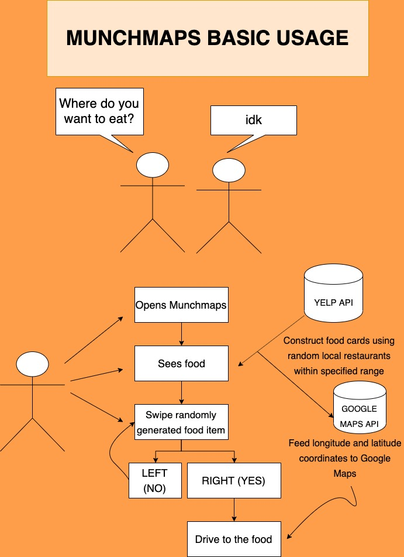
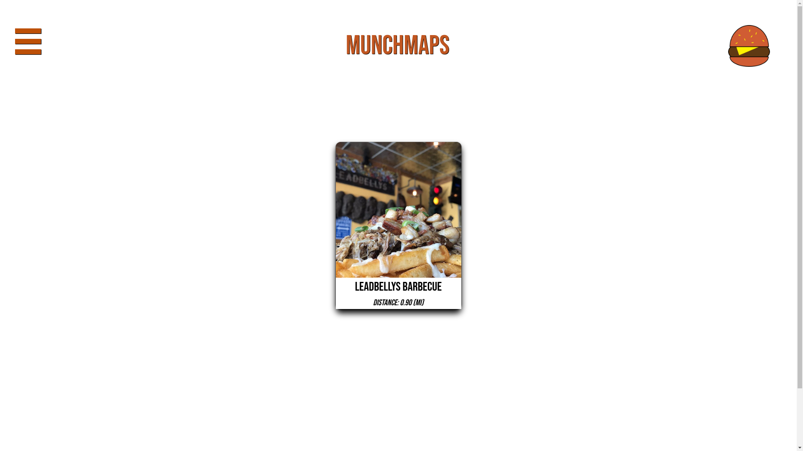
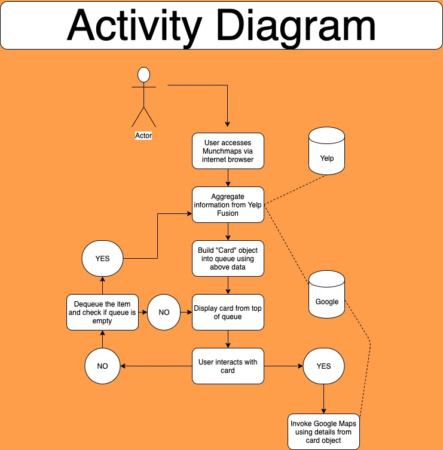
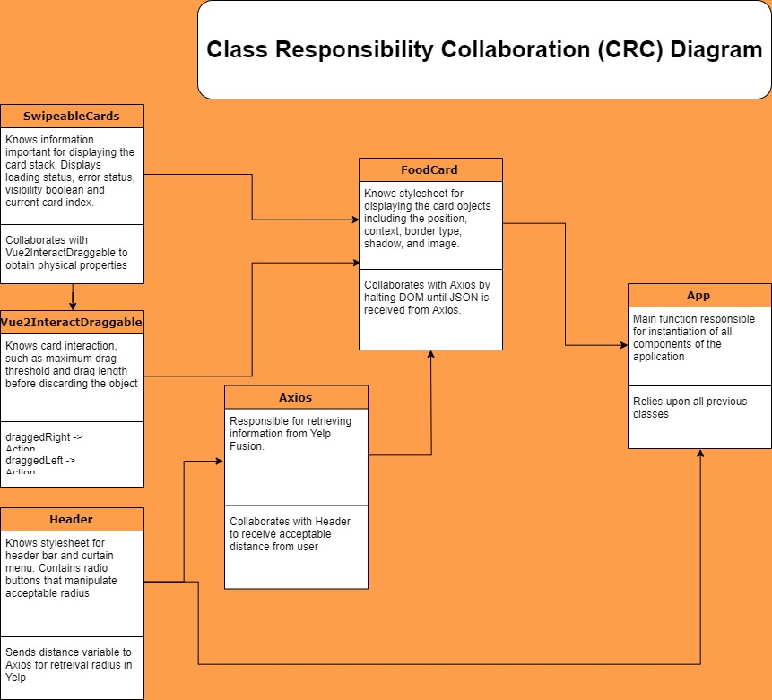
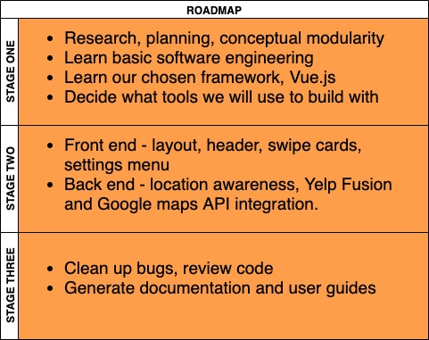

# Munchmaps
A single page web application to connect hungry users with local restaurants. Munchmaps runs inside all modern browsers and is built using [Vue.js](https://vuejs.org/), [Tailwind CSS](https://tailwindcss.com/), and [Node.js](https://nodejs.org/en/about/) technologies.

## Purpose
Deciding where to eat can be a frustrating and time consuming process. This phenomenon is commonly referred to as [paralysis by analysis](https://en.wikipedia.org/wiki/Analysis_paralysis). 

Munchmaps seeks to simplify the decision making process by removing unneccessary noise and leveraging local Yelp communities to curate favorite dishes. Instead of bombarding a person with dozens of choices, design making is simplified by reducing complexity into one choice at a time. There is only ever one choice to be made in Munchmaps: Yes or No.

## Basic Usage

## User Interface

1. **FOOD CARD**.

The main focus of attention. A randomly selected food item is displayed, along with details such as restaurant location, restaurant name, and current distance.

2. **SWIPE LEFT / SWIPE RIGHT**

Interactive component. When using a device with a touchscreen, dragging the card will invoke a reject or accept function. Similarly, the mouse pointer can be used in place of a touchscreen.

3. **CURTAIN MENU**

User is able to select maximum radius from their current location by using radio buttons.

## Activity Diagram

## CRC Diagram

## Current Roadmap

## Release History
* 1.2
    * Modified some wording in readme to accurately describe usage.
    * Included information on the frameworks used.
    
* 1.1
    * ADD: Basic usage diagram, activity diagram, CRC diagram
    * ADD: Current layout UI
    * ADD: Roadmap

    * REMOVE: Mock layout, ASCII flowchart
    * REMOVE: Meme image

* 1.0
    * CHANGE: Foundational index page and stylesheets created.
    * CHANGE: README created.

## Meta

CPSC 362-01 Fall 19

Brendon Linthurst

Shane Spangenberg
