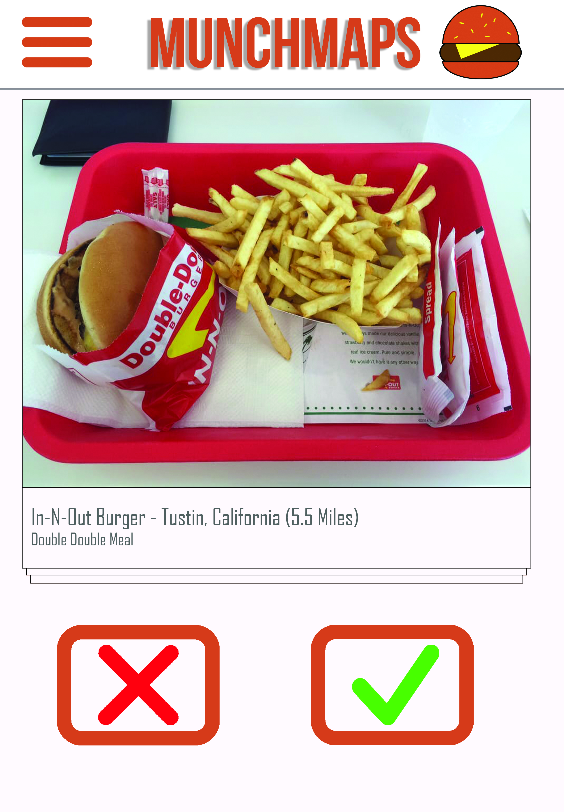
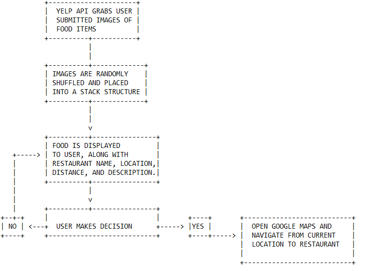

# Munchmaps
A simple web application to connect hungry users with local restaurants.

## Purpose
Deciding where to eat can be a frustrating and time consuming process. This phenomenon is commonly referred to as [paralysis by analysis](https://en.wikipedia.org/wiki/Analysis_paralysis). 

Munchmaps seeks to simplify the decision making process by removing unneccessary noise and leveraging local Yelp communities to curate favorite dishes. Instead of bombarding a person with dozens of choices, the decision process is simplified by reducing choices to incremental choices of single items at a time. There is only ever one choice to be made in Munchmaps: Yes or No.

## User Interface

1. **FOOD CARD**.

The main focus of attention. A randomly selected food item is displayed, along with details such as restaurant location, restaurant name, and current distance.

2. **DECIDER BUTTONS**

Interactive component. When using a device without a touchscreen, the buttons will invoke the same methods as swiping left or right.

3. **SETTINGS**

Various settings are dispayed when selecting the hamburger button, such as maximum radius.

## Decision flow

## Release History

* 0.0.1
    * CHANGE: Foundational index page and stylesheets created.
    * CHANGE: README created.

## Meta

CPSC 351-01 Fall 19
Brendon Linthurst
Shane Spangenberg

